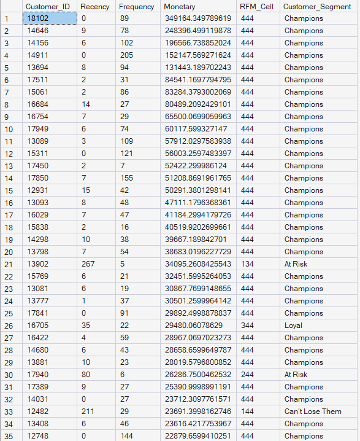

# Retail Customer Segmentation (RFM Analysis)

##  Project Overview
Analyzed 407,000+ transaction records for a UK-based online retailer to identify customer segments. Used **SQL Window Functions (NTILE)** and **CTEs** to calculate Recency, Frequency, and Monetary (RFM) scores, enabling targeted marketing strategies for "Champions" vs. "At-Risk" customers.

##  Tools Used
- **Database:** Microsoft SQL Server 2022
- **IDE:** SQL Server Management Studio (SSMS)
- **Functions:** `CTE`, `DATEDIFF`, `NTILE`, `CAST/CONVERT`, `CASE`

##  Key Insights
- **Champions (Score 444):** High-spend, frequent buyers. *Strategy: Upsell new products.*
- **Can't Lose Them (Score 144):** High-value but lapsed. *Strategy: Win-back campaign with discounts.*
- **New Customers (Score 411):** Recent first purchase. *Strategy: Welcome emails to drive retention.*

##  Output

##  SQL Logic
The analysis follows a 3-step pipeline:
1. **Data Cleaning:** Converted non-standard date formats (`dd.mm.yyyy`) to SQL `DATETIME` using `CONVERT`.
2. **RFM Calculation:** Aggregated metrics per customer using `DATEDIFF` and `SUM`.
3. **Segmentation:** Applied `NTILE(4)` to rank customers into quartiles and assigned human-readable labels using `CASE`.
