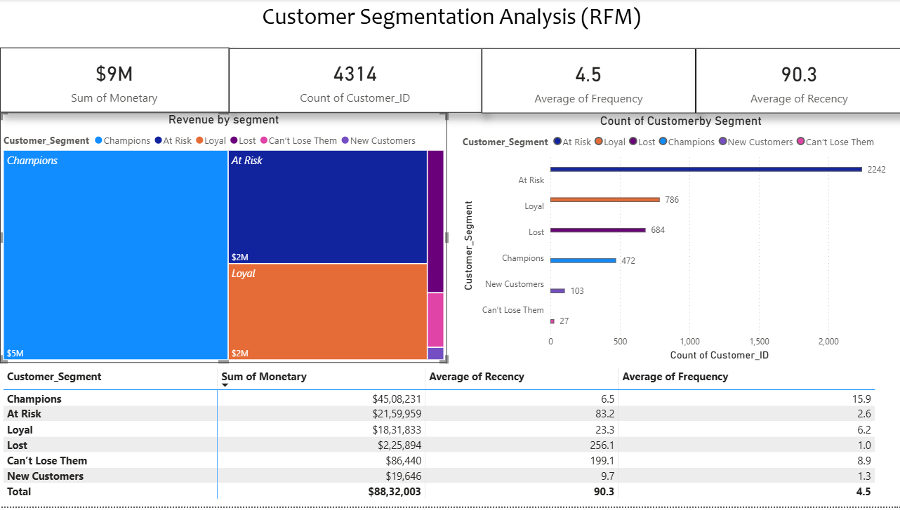

# Retail Customer Segmentation (RFM Analysis)

##  Project Overview
Analyzed 407,000+ transaction records for a UK-based online retailer to identify high-value customer segments. This project implements an **RFM (Recency, Frequency, Monetary)** model to classify customers into actionable groups such as "Champions", "Loyal", and "At Risk".

The insights are first generated via complex SQL queries and then visualized in an interactive Power BI dashboard for strategic decision-making.

##  Tech Stack
- **Database:** Microsoft SQL Server 2022
- **SQL Skills:** CTEs, Window Functions (`NTILE`), Aggregate Functions, Data Type Conversion (`CAST/CONVERT`), Conditional Logic (`CASE`)
- **Visualization:** Microsoft Power BI (DAX, Data Modeling)
- **Dataset:** UCI Machine Learning Repository

##  SQL Logic & Transformation
The core of this project lies in the SQL data transformation pipeline, which turns raw transaction logs into business intelligence.

### **Step 1: Data Cleaning & Preparation**
Raw dates were in a non-standard text format (`dd.mm.yyyy hh.mm`). Used `ALTER TABLE` to create a staging column and `CONVERT(DATETIME2, ..., 105)` to transform the data into a usable SQL date format for accurate calculations.

### **Step 2: RFM Calculation via CTEs**
Used a **Common Table Expression (CTE)** to aggregate data at the customer level.
* **Recency:** Calculated using `DATEDIFF(DAY, ...)` to find the days since a customer's last purchase relative to the dataset's max date.
* **Frequency & Monetary:** Used `COUNT(DISTINCT Invoice)` and `SUM(Quantity * Price)` to determine purchase volume and total spend.

### **Step 3: Segmentation with Window Functions**
Applied the **Window Function `NTILE(4)`** to statistically rank customers into quartiles for each R, F, and M metric. A final `SELECT` statement with a `CASE` expression mapped these numerical scores (e.g., "444") to human-readable segments like "Champions" or "Lost".

### **SQL Query Output**
*A sample of the final processed data, showing customer scores and their assigned segment.*

---

## Executive Dashboard
*The final SQL output was loaded into Power BI to create a high-level view of customer value and risk.*

### **Key Insights & Metrics**
- **Total Revenue:** **$8.83M** derived from 4,314 active customers.
- **Champions (Score 444):** The most valuable segment, purchasing every **6.5 days** on average.
- **Lost Customers:** A critical segment representing huge churn risk; average inactivity is **256 days**.

##  Data Source
The dataset used in this analysis is the "Online Retail II" dataset, provided by the UCI Machine Learning Repository.

* **Dataset:** [Online Retail II](https://archive.ics.uci.edu/dataset/502/online+retail+ii)
* **Citation:**
  > Chen, D. (2012). Online Retail II [Dataset]. UCI Machine Learning Repository. https://doi.org/10.24432/C5CG6D.

* **Note on Data Privacy:** This project uses a public dataset for educational purposes. No proprietary or private customer data is included in this repository.
